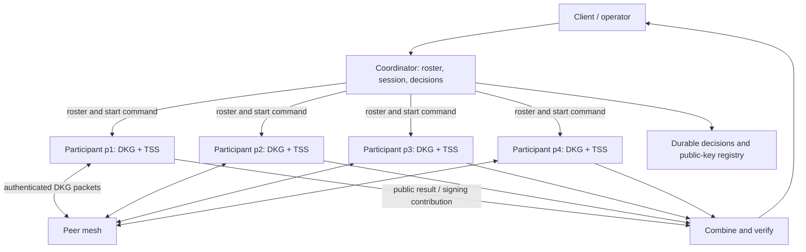

# Architecture

This document separates the code that runs today from the proposed end state. Current evidence is local: four participant processes, a 3-of-4 threshold, the E0–E6 controller fault schedules, and a direct peer E0 ceremony. See [experiment records](experiments.md) for recorded fault outcomes.

## Current implementation

```text
                         dkgctl (controller and packet scheduler)
                        /                                      \
            run / experiment                         real-run / real-ceremony
                   |                                           |
            plain local TCP                              mutual TLS RPC
                   |                                           |
       p1..p4 mock participants                    p1..p4 Kyber participants
       explicit Machine + Mock adapter             Kyber Pedersen DKG adapter
       per-participant JSON-line WAL               private DKG state in memory
       mock metrics + JSON logs                     real metrics + JSON logs
                   |                                           |
            mock result JSON                     public group key / result JSON
                                                               |
                                               controller decision journal
                                               (nonce hashes, status only)

            real-p2p-run (local E0 path)
                 |
           setup / start / public result
                 |
          p1 <----> p2
          |  \      / |
          |   \    /  |       direct mutual TLS TCP + JSON packets
          |    \  /   |
          p3 <----> p4
```

For `real-run` and `real-ceremony`, the controller launches local processes, collects their public identities, chooses delivery order, forwards packets, and collects terminal results. The final private DKG shares are not returned through the result API. The controller does see relayed protocol packets; justification packets can contain share material. `real-p2p-run` is a separate local E0 path: the controller provides identities, nonce, and peer addresses and starts each node; the nodes exchange packets directly over mutual TLS TCP connections and the controller reads public results.

The relay makes fault injection repeatable, but it is one availability dependency and one place that can withhold or reorder every packet. Packet signatures stop undetected modification of signed content; they do not guarantee delivery. The direct path removes that relay from its E0 data path, while still requiring stronger failure handling and consistent broadcast behavior before it can replace the supervised path.

| Code | Responsibility |
|---|---|
| [`cmd/dkgctl`](../cmd/dkgctl/main.go) | CLI, local process lifecycle, normal runs, and fault schedules |
| [`internal/api`](../internal/api/rpc.go), [`internal/transport`](../internal/transport/tcp.go) | JSON request/response contract and TCP or TLS calls |
| [`internal/protocol`](../internal/protocol/machine.go) | Mock ceremony state machine, message validation, and idempotency |
| [`internal/durable`](../internal/durable/wal.go) | Mock participant WAL, synced before acknowledging accepted state changes |
| [`internal/cryptoadapter`](../internal/cryptoadapter/kyber.go) | Mock contributions and real Kyber DKG packet adapter |
| [`internal/participant`](../internal/participant/real.go) | Process RPC servers, structured logs, and Prometheus metrics |
| [`internal/realexperiment`](../internal/realexperiment/run.go) | Real packet scheduling, fault injection, and public result comparison |
| [`results`](../results) | Recorded single-run local evidence; not latency or security guarantees |

### Mock ceremony flow

1. `dkgctl run` starts participants with temporary WAL files and sends `begin` with session, epoch, round, roster, and threshold.
2. Each `Machine.Begin` creates a deterministic **mock** contribution, records `begin`, and returns one logical SHARE per peer.
3. The controller forwards SHARE messages. `ReceiveShareWithOutcome` checks ceremony coordinates, sender, recipient, logical message ID, and payload before recording and applying a new message. A valid duplicate has no second state transition.
4. The mock state path is `INIT → DEAL → SHARE_EXCHANGE → VERIFY → FINALIZE`, or `TIMED_OUT`. This implementation waits for every roster contribution before VERIFY even if the configured threshold is lower.
5. A restarted mock participant replays accepted events from its own WAL and resumes the **same** session. This is runtime recovery for deterministic mock data, not recovery of Kyber's private polynomial.

### Real DKG flow

1. `real-ceremony` starts four local participant processes. It generates an ephemeral local CA plus controller and participant certificates; real RPC requires mutual TLS. Each process generates its own long-term private scalar.
2. The controller gathers public identities, creates a fresh nonce, and sends the same roster and 3-of-4 configuration to every process. Each adapter creates a drand/kyber `v1.3.2` Pedersen DKG engine over Ed25519.
3. Participants generate signed deal bundles with encrypted deal shares. The controller relays deal, response, and any justification packets in a defined order. Receivers check nonce, sender/index binding, signature, duplicate identity, and phase before giving packets to Kyber.
4. Kyber decides qualification and yields each participant's final private share and group public key. The final private share remains in the participant process. `PublicResult` checks its public share against commitments and returns only public data. The controller compares finalized group public keys. Justification packets, when emitted, contain protocol share material that the relay can read.
5. `real-run` applies E0–E6 delivery/process schedules. E4 demonstrates that three responsive participants can finalize with one group public key; E5's 2:2 split finalizes nobody. E6 is an injected hold followed by terminal-state rejection, not an autonomous network timeout measurement.
6. `real-ceremony` is the normal supervised command. It currently requires **all four** participants to finalize successfully. On a detected RPC/process failure, it stops the local processes, records `aborted`, and starts a **new** attempt with fresh identities and nonce. Its synced journal contains attempt numbers, nonce hashes, and decisions, never private DKG state. E3 uses this same supervisor and tests an old signed deal against the new session.

### Direct peer E0 flow

1. `real-p2p-run` starts four loopback participants with certificates valid for server and peer client authentication. The controller collects public identities and configures the same 3-of-4 roster, nonce, and distinct peer addresses on every node.
2. Each node generates its own deal bundle, sends it directly to the other three nodes, waits for all three deals, processes them, then directly sends and receives response bundles. Peer RPC accepts only `real-accept`; the certificate identity must match the packet sender and configured roster. The controller certificate cannot invoke packet or phase RPC in peer mode.
3. Nodes finalize locally. The controller polls status and compares only public group keys. The path currently requires all four participants and a complaint-free run; a timeout or need for justifications aborts it. It has no peer-mode crash recovery, quorum progress under participant loss, or multi-host validation.

Mock and real participants expose separate bounded-label Prometheus metrics and structured JSON request logs. The real process accepts externally provided TLS files, but multi-host certificate provisioning and networking have not been validated end to end. An abrupt controller crash may leave old local child processes running. No distributed threshold signing or durable custody of completed real private shares exists yet.

## Proposed final architecture

The intended end state adds a usable threshold signing flow after DKG while keeping every private share within its owning participant. This is a design target, not an implemented or verified architecture.



**DKG path:** The coordinator fixes an authenticated roster and unique session/epoch and starts the ceremony. Participants then exchange DKG packets directly with peers over authenticated channels, finalize under the selected protocol's qualification rule, and retain their private shares under a defined custody and recovery policy. The coordinator records public results and ceremony decisions; it is not on the DKG packet data path. A failed ceremony is fenced and restarted with a new nonce unless the chosen library supports a verified safe checkpoint format. The local E0 direct path demonstrates packet transport, but the complete failure and recovery behavior here remains a target. This split resembles drand's [coordinator setup and node-driven DKG](https://docs.drand.love/docs/specification/).

**Signing path:** A sign request binds a key/epoch, message digest, and request ID. At least three authorized participants use their own shares to produce signing contributions. A combiner assembles and verifies one signature against the DKG group public key. Two participants cannot produce a valid signature; no component reconstructs or stores the complete private key. Replay, duplicate requests, participant loss, and timeout must have explicit terminal behavior.

**Operational path:** Deploy participants on separate failure domains with authenticated communication, provision and rotate identities, protect persistent signing shares, and expose bounded metrics, structured events, and audit records. Separate operator control RPC from participant packet RPC, as drand's [DKG control-plane postmortem](https://docs.drand.love/blog/2025/03/21/drand-v2-0-postmortem/) illustrates. Signed peer packets still need delivery, replay, timeout, and consistent-broadcast rules: a P2P mesh alone does not make a broadcast reliable or prevent equivocation, a limitation noted in drand's [security model](https://docs.drand.love/docs/security-model/). The coordinator and peers need recovery rules that avoid two active attempts for one ceremony. Multi-host fault tests must back any availability claim.

The signing protocol and curve remain a design decision. The current Ed25519 DKG adapter does not include a compatible distributed signing implementation. The test that reconstructs three shares in one process proves a narrow key-consistency property; it must not be used as the signing path. A future protocol/library choice must establish share compatibility, security assumptions, key storage format, and 3-of-4/2-of-4 process-level tests before this diagram can be described as implemented.
